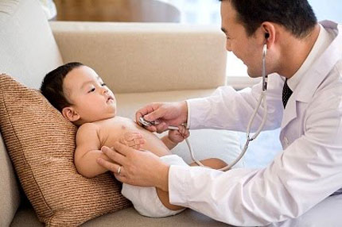

Mùa thu tuy không lạnh như mùa đông và nóng như mùa hè nhưng thời tiết có sự thay đổi thất thường giữa ngày và đêm nên rất dễ hình thành các loại bệnh ở trẻ nếu bạn không có biện pháp phòng ngừa thích hợp.

Trong mùa này, các loại muỗi, công trùng phát triển mạnh, nhiều loại hoa đua nở nên nguy cơ trẻ mắc các bệnh truyền nhiễm, côn trùng đốt hoặc dị ứng, hen suyễn do cây cối, phấn hoa… càng tăng cao. Cha mẹ cần hết sức cảnh giác và xử trí kịp thời để phòng và điều trị bệnh hiệu quả cho con.

#### Bệnh đường hô hấp ở trẻ

Các triệu chứng khi bị viêm họng, viêm phế quản có thể bao gồm: Sưng họng, ớn lạnh, sốt, đau đầu, buồn nôn và hay thỉnh thoảng bị nôn. Họng tấy đỏ và amiđan sưng, đôi khi có hạch… Cần đưa trẻ đến bác sĩ để kiểm tra họng, chẩn đoán loại bệnh.

Các triệu chứng của cảm cúm có thể bao gồm: nghẹt mũi, chảy nước mũi, đau đầu, sưng họng, mệt mỏi, đau cơ… Trong trường hợp này, cha mẹ nên cho trẻ nghỉ ngơi, uống nhiều nước và dùng thuốc theo chỉ dẫn của bác sĩ.

#### Sốt phát ban ở bé

Sốt phát ban ở bé thường gây ra bởi virus sởi hoặc virus rubella. Bệnh gây ra bởi virus sởi còn gọi là ban đỏ, bệnh gây ra bởi virus rubella còn gọi là ban đào.

Sốt phát ban thường lây truyền qua đường hô hấp, khi bé hít thở chung nguồn khí với người bệnh. Triệu chứng của bệnh là trẻ bị sốt, nổi ban đỏ khắp người, nhiều nhất ở thân mình và tứ chi. Đây là bệnh lây nhiễm do virus nên chỉ có thể điều trị các triệu chứng.

#### Đau mắt đỏ ở trẻ em

Bệnh đau mắt đỏ thường gặp vào mùa hè đến cuối mùa thu. Bệnh thường có biểu hiện rõ nhất là mắt đỏ và có dử mắt, mi mắt sưng nề, mọng, mắt đỏ (do cương tụ mạch máu), đau nhức, chảy nước mắt… Trẻ bị đau mắt đỏ cần được đi khám kịp thời để điều trị theo đúng nguyên nhân gây bệnh và tránh các biến chứng.

#### Bệnh tiêu chảy ở bé

Tiêu chảy cấp do rotavirus là bệnh thường gặp ở bé vào mùa thu đông. Bé có thể ho, sốt nên nhiều cha mẹ dễ nhầm với viêm đường hô hấp, viêm mũi họng. Biến chứng của bệnh có thể dẫn đến trụy mạch, thậm chí tử vong nếu không được bù nước kịp thời. Vì thế, nếu chăm sóc ở nhà, cha mẹ nên cho bé uống dung dịch oresol theo đúng hướng dẫn ghi trên bao bì và đến bệnh viện để được điều trị kịp thời.

#### Bé bị sốt xuất huyết

Bệnh này thường gặp vào mùa thu vì trong mùa này, muỗi sinh sản nhiều. Biểu hiện bệnh là sốt cao đột ngột trong 2-4 ngày liên tục, xuất hiện các đốm đỏ xuất huyết dưới da mọc thành từng đốm rải rác. Khi có những biểu hiện trên cần đưa trẻ đến bệnh viện kịp thời, tuyệt đối không được tự ý dùng thuốc hạ sốt mà không có chỉ dẫn của bác sĩ.

#### Cách phòng bệnh cho trẻ trong mùa thu

Để phòng bệnh cho trẻ, cha mẹ cần ghi nhớ những nguyên tắc sau đây:

- Tiêm chủng đầy đủ cho trẻ
- Bổ sung những dưỡng chất như vitamin C, kẽm, đạm vào chế độ ăn uống của trẻ để ngăn ngừa cảm cúm, hỗ trợ tăng cường sức đề kháng toàn diện cho cơ thể.
- Luôn giữ vệ sinh nhà cửa sạch sẽ, thoáng mát, cần đảm bảo chế độ lưu thông không khí tốt.
- Với trẻ nhỏ, đêm lạnh nên cho trẻ mặc quần áo ấm, trưa nóng có thể cởi bớt ra. Không mặc nhiều, dày vì mồ hôi toát ra thấm ngược, gây ốm sốt. Tránh loại áo liền quần thít vào ngực khiến khó thở.
- Nếu trẻ ốm sốt vẫn cần lau rửa, tắm giặt, vệ sinh mũi họng, cơ thể hàng ngày sạch sẽ.
- Giữ vệ sinh cá nhân cho trẻ bằng cách tắm rửa hàng ngày với xà phòng diệt khuẩn. Hướng dẫn trẻ phải biết rửa tay trước và sau khi ăn, khi đi vệ sinh hoặc tiếp xúc vào các đồ vật có nguy cơ gây bệnh.'

*Hy vọng với thông tin 5 loại bệnh thường gặp ở bé trong mùa thu cần phòng tránh trên đây các mẹ sẽ có thêm nhiều thông tin hữu ích chăm sóc phòng ngừa bệnh cho trẻ trong mùa thu này một cách hiệu quả. Chúc các bé luôn khỏe mạnh phát triển toàn diện mỗi ngày và hãy luôn đồng hành ủng hộ cho Anvi Baby để có thêm nhiều thông tin chăm sóc sức khỏe bổ ích nhé.*
