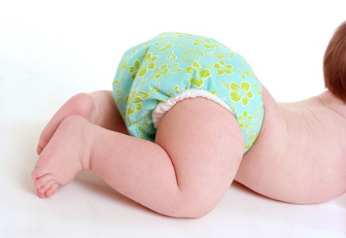
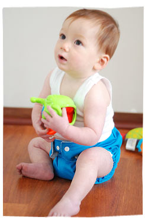
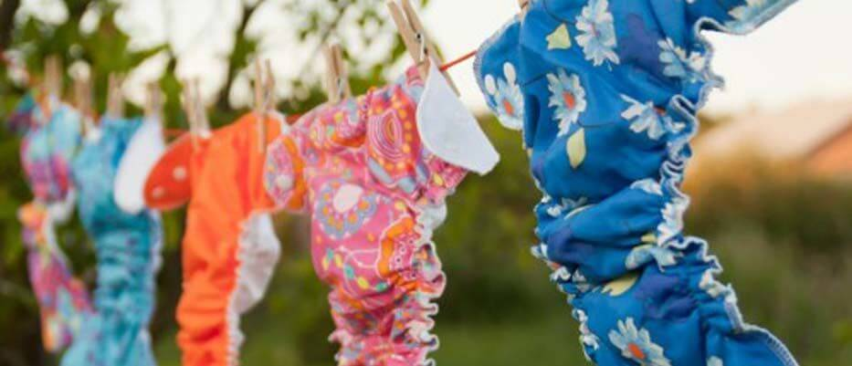

#### 1.	Tã vải hiện đại khác gì tã vải truyền thống?

Tã vải hiện đại không giống như tã vải thời ông bà ta vẫn dùng là một mảnh vải xô gấp lại. Tã vải hiện đại được thiết kế với chất liệu co dãn, đàn hồi nhằm mục đích vừa khít với em bé, mặt ngoài không thấm nước, chống rò rỉ ra bên ngoài, miếng lót thấm hút rất nhiều và nhanh, lớp trong cùng với da bé thì nhanh khô thoáng mát, hàng cúc bấm rất dễ dàng thay đổi độ rộng với sự lớn lên từng ngày của bé và bền chắc giúp tã ôm sát đùi bé, các rãnh chống tràn và chun ở lưng tạo sự thoải mái cho bé.

*Đặc biệt tã vải Anvibaby tuyệt đối không có bất kỳ hóa chất nào với chất liệu vải mềm mại, có khả năng kháng khuẩn, chống hăm da cho bé.*

#### 2.	Tã vải hiện đại giặt có dễ không?

Nhiều mẹ hay than phiền sử dụng tã vải phải tốn công giặt giũ, làm mất nhiều thời gian. Để khắc phục nhược điểm này Anvi baby đã chọn loại vải cao cấp nhất, các đường chỉ rất chắc chắn, nút đóng siêu bền để mẹ có thể giặt máy mà không sợ hư hỏng.

Cách giặt tã cũng đơn giản chứ không mất quá nhiều thời gian như các mẹ nghĩ đâu. Sau khi bé ị, mẹ dùng vòi xịt toilet xối chất cặn bã vào bồn cầu (lớp bề mặt tiếp xúc với da bé làm bằng chất liệu suede cloth ít bám bẩn), sau đó đem ngâm tã bẩn vào một xô nước để gom lại giặt tã trong ngày. Mẹ có thể giặt tay hoặc giặt máy giặt (có thể giặt chung với quần áo thông thường của bé), khi giặt chú ý không sử dụng nước xả vải hoặc chất tẩy như Javel vì sẽ làm giảm độ thấm hút và độ bền của tã vải và lớp lót. Không giặt tã với nước nóng trên 60 độ C.

#### 3.	Có thể dùng tã vải hiện đại khi bé đi học hoặc đi chơi bên ngoài không?

Hoàn toàn được các mẹ ạ, và còn rất thời trang nữa đấy! Tã vải hiện đại Anvi Baby thiết kế đàn hồi, co dãn vừa khít với bắp chân của bé,  bé có thể chơi đùa năng động mẹ không lo ngại gì cả. Nhờ 2 nút bấm thêm trên 2 tai tã, mẹ hoặc cô giáo có thể cuộn tã đã sử dụng và khoá tã lại bằng nút bấm tã đã dùng, cho vào túi đựng tã sẽ hoàn toàn sạch sẽ.

#### 4.	Tã vải hiện đại AnVi Baby sử dụng được bao lâu ?

Tã vải có thể tái sử dụng đến 1000 lần và có thể dùng cho bé đến 3 năm. Điều này chắc chắn đúng nếu mẹ giặt và sử dụng tã đúng như hướng dẫn.

 Thường thì một chiếc áo bạn giặt đi giặt lại nhiều lần thì chắc chắn nó sẽ không còn được như ban đầu tã vải Anvi Baby cũng vậy. Dùng nhiều thì vải không còn được mới như lúc đầu nhưng chắc chắn tã sẽ không bị ố vàng, rách hay bong nút.
Khi sản xuất Anvi Baby chọn lựa rất kĩ loại vải làm sao cho chiếc tã có độ bền cao, có thể giặt máy đỡ vất vả cho mẹ và có tuổi thọ lâu, nút được đóng chắc chắn, đường chỉ may kĩ và chắc.

Tã vải sử dụng nhiều lần, được giặt càng nhiều lần thì độ thấm hút càng tốt.  

#### 5.	Mua bao nhiêu tã cho bé là vừa?

Tùy vào độ tuổi của bé, đặc điểm từng bé và số lần các mẹ muốn giặt tã mà mua nhiều hay ít. Mẹ thử mua 3 tã ban ngày, 3 tã ban đêm và mua thêm vài miếng lót riêng để dự phòng mẹ thay nhiều cho bé mà lót chưa kịp kho như vỏ tã.

#### 6.	 Vẫn thấy các vết vàng vàng xuất hiện trên miếng lót sau khi giặt xong

Nếu bé đang bú mẹ và ị phân nước thì các vết vàng vàng xuất hiện trên miếng lót là hoàn toàn không thể tránh khỏi, nhưng các mẹ cứ yên tâm khi các mẹ phơi nắng thì các vết ấy sẽ mờ đi nhanh chóng do tính chất tẩy tuyệt vời của ozon có trong ánh nắng. Còn nếu hôm nào trời không nắng nhiều vết ấy vẫn còn mờ mờ thì cũng không có vấn đề gì đâu nhé! Tuyệt đối không nên dùng thuốc tẩy và nước xả vải như đã nói ở trên.

#### 7.	Phải giặt tã vải bằng nước sôi mới sạch hết vi khuẩn?

Bản thân nước tiểu rất "sạch" về mặt vi sinh vật. Nước tiểu chủ yếu là nước - khoảng 95% - và một số loại muối, hợp chất vô cơ và hữu cơ. Nước tiểu của người mang một số bệnh có thể chứa thêm 1 số thành phần khác, ví dụ như đường trong trường hợp bệnh tiểu đường. Khi nước tiểu có chứa vi khuẩn thì đó là dấu hiệu của viêm nhiễm, thường thấy nhất là viêm đường tiểu. Nhưng đối với nước tiểu của em bé thì thuộc hàng “rất sạch” nên các mẹ yên tâm không cần phải giặt bằng nước sôi đâu nhé! Nếu các mẹ giặt bằng nước sôi nhiều quá thì sẽ làm hư vải mà lại không cần thiết. Tã đã sài có chứa nước tiểu chỉ cần sả sơ và giặt bình thường như các loại quần áo khác.

