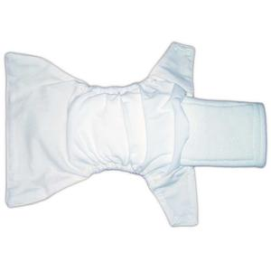

##### Một tã Anvi Baby gồm 1 vỏ tã và 1 miếng lót. Miếng lót được đưa vào bên trong vỏ tã qua khe nhét lót được thiết kế ở vỏ và có 1 nút bấm để cố định lót và vỏ ở miệng khe. Nhờ đó miếng lót được cố định ở trong vỏ tã thực hiện chức năng thấm hút của mình và giữ nước tốt hơn. Vỏ tã – lớp ngoài cùng thì chống thấm giúp chống rò rỉ nước ra bên ngoài, lớp trong cùng tiếp xúc với da bé thì mềm mại, nhanh khô chống thấm ngược lên da bé.

#### 1. Tã ban ngày

- **Vỏ tã 2 thành phần:** gồm 1 lớp chống thấm PUL có in nhiều họa tiết dễ thương + 1 lớp Suede Cloth mềm mại khi tiếp xúc với da bé, trơ với chất bẩn và nhanh khô, chống thấm ngược lên da bé.

- **Miếng lót:** 4 lớp Microfiber thấm hút cực nhanh và cực tốt

Tã ban ngày thiết kế nhẹ nhàng và có rãnh chống tràn hai bên giúp bé dễ dàng vận động mà không sợ tràn ra hai bên, tã ban ngày duy trì độ thấm hút khoảng 2-4 giờ tùy theo mức độ tè em bé, mẹ để ý để thay tã cho bé để bé được thỏa mái.

#### 1. Tã ban đêm

- **Vỏ tã 3 thành phần:**  1 lớp chống thấm PUL có in nhiều họa tiết dễ thương + 1 lớp Suede Cloth mềm mại khi tiếp xúc với da bé, trơ với chất bẩn và nhanh khô, chống thấm ngược lên da bé + 1 lớp Microfiber may cố định vảo trong lớp Sude Cloth để tăng độ thấm hút và diện tích thảm hút cho tã đêm.

- **Miếng lót:** 3 lớp Microfiber thấm hút cực nhanh và cực tốt + 1 lớp than hoạt tính (Bamboo Chocoal) để chống khuẩn chống hăm và khử mùi khi sử dụng trong thời gian dài suốt 6-8 tiếng cho bé.

Tã ban đêm có thiết kế lót loe ra ở phần mông để bé nằm không bị tràn ở mông,
Cả tã ngày và tã đêm đều có chung đặc điểm thiết kế hàng nút bấm ngang để điều chỉnh độ rộng của phần eo bé, và dây chun tăng đưa ở hai đùi để điều chỉnh độ rộng vừa khít với đùi của bé.

Mẹ tham khảo cách mặc tã và giặt tã đúng cách ở bài viết Các bước sử dụng tả vải Anvi Baby nhé!

Chúc các mẹ tìm được sản phẩm ưng ý cho con yêu của mình!
