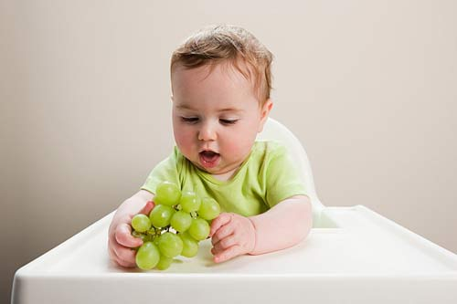

Hoa quả có rất nhiều vitamin, trẻ ăn hoa quả rất tốt cho sức khoẻ… bất cứ bà mẹ nào cũng biết điều đó. Hầu hết chúng ta đều rất háo hức đợi đến khi con biết ăn dặm để cho con ăn những thìa hoa quả đầu tiên trong đời. Hoa quả có vị ngọt, thơm tự nhiên nên trẻ rất dễ ăn và rất thích ăn. Tuy nhiên, nếu cho con ăn không đúng cách, mẹ sẽ khiến bao công sức của mình…”đổ sông đổ bể’.

Dưới đây là những lỗi sai “kinh điển” của các bậc cha mẹ:

##### Cho con ăn hoa quả để “tráng miệng” sau bữa ăn

Đây là một trong những lỗi sai rất phổ biến của mẹ Việt, bắt đầu từ nhu cầu ăn mặn xong thường cần có đồ ngọt ngọt để tráng miệng và đổi vị. Tuy nhiên, mẹ nên ghi nhớ: Hoa quả chỉ nên được ăn với một cái dạ dày “rỗng”, tức là trước đó, trẻ chưa từng được ăn gì.

Cứ tưởng tượng, khi bé vừa ăn xong bát cháo lớn, mẹ cho con ăn them chút chuối. Hai thìa chuối đáng lẽ ra đã có thể đi thẳng vào ruột và được cơ thể hấp thụ. Vậy nhưng bát cháo lớn còn đang trong dạ dày đã cản trở chúng. Thêm vào đó, hoa quả vào ruột sẽ sản sinh ra axit. Các axit này sẽ làm hỏng các chất dinh dưỡng có trong “bát cháo” đang ở dạ dày bé, đồng thời gây ra đầy bụng, khó tiêu.

Hẳn mẹ còn nhớ cảm giác vừa ăn tối xong mà ăn một quả chuối, ta sẽ “có hứng” đi toilet ngay lập tức. Đó là vì axit trong chuối ở dạ dày đã khiến bữa ăn bị “hỏng” và cơ thể muốn tống chúng ra ngoài.

Đừng để điều đó xảy ra tương tự với bé.

Lời khuyên hợp lý nhất, đó là cho trẻ ăn hoa quả vào bữa chiều hoặc 30 phút trước khi mẹ dự định cho bé ăn bất cứ thứ gì.

##### Ép hoa quả lấy nước uống cho được nhiều

Ăn nguyên quả quít thì trẻ chỉ ăn được 1 nhưng nếu ép lấy nước không, trẻ có thể ăn được 2,3 quả một lúc. Thêm vào đó, vì nước ép tiện lợi nên nhiều bà mẹ lựa chọn cho con uống nước ép hoa quả.

Thực tế, một số loại nước ép hoa quả đóng hộp trên thị trường có 100% là hoá chất tổng hợp. Nhưng kể cả khi mẹ đảm bảo chỉ ép cho con uống hoa quả tươi, đó vẫn là một ý tưởng không hay.

Hoa quả ép, chẳng khác gì nước có vị hoa quả, nhưng tất cả các chất có lợi đều đã bị vứt đi. Không có chất xơ, không có một số vitamin chỉ có trên màng và cũng không có cơ hội cho bé luyện tập khả năng nhai. Vì vậy nếu được, mẹ hãy thử làm bằng tay: bơ dầm, dưa hấu dầm, chuối nạo và quít miếng…Thay vì cho vào máy xay và xay nhuyễn hết chúng lên thành một hỗn hợp nước lõng bõng.

##### Trộn lẫn vài loại hoa quả cho con ăn một lúc

Cũng vẫn một lỗi khá phổ biến của mẹ Việt: Kết hợp hai ba loại hoa quả vào chung một bát rồi xay nhuyễn hoặc dầm ra để xúc cho trẻ ăn. Ăn hoa quả trộn lẫn có thể làm hại hệ tiêu hoá non nớt của trẻ. Chúng không những kết hợp với nhau tạo nên một lượng đường khổng lồ mà còn khiến trẻ bị lẫn vị và mất đi khả năng phân biệt từng loại hoa quả với từng vị khác nhau.

##### Ăn hoa quả trước khi đi ngủ

Trẻ ăn hoa quả trước khi đi ngủ có thể khiến bé tỉnh táo của mức vì đầy bụng, từ đó dẫn đến mất ngủ.

##### Ăn cam quít ngay trước và sau khi bú sữa

Trong vòng 1 giờ, không nên để bé cùng ăn sữa và cam, quýt. Chất chua (acid) trong loại hoa quả này, khi gặp protein trong sữa có thể bị ngưng động, kết tủa, ảnh hưởng đến quá trình cơ thể bé hấp thụ chất dinh dưỡng từ cam, quýt.

##### Mua hoa quả xanh về dấm cho chín dần

Ngày nay, vì lý do an toàn thực phẩm, lại sợ trẻ ăn phải hoa quả bị ngâm thuốc giục chín, rất nhiều chị em tỏ ra chuộng phương pháp mua hoa quả xanh về rồi để tự chín trong nhà. Tuy nhiên, trừ những trường hợp bất khả kháng, ta vẫn nên để hoa quả được chín tự nhiên dưới ánh nắng mặt trời. Hoa quả chín nhờ sự quang hợp ánh nắng mặt trời sẽ có hàm lượng vitamin cao và bổ dưỡng hơn.

##### Cho con ăn quá nhiều hoa quả

Hoa quả ngon, ngọt nên trẻ con rất thích. Một số chị em vì thấy con ăn “tì tì”, lại nghĩ hoa quả lành nên mặc sức để bé ăn mà không cần hạn chế. Điều này là hoàn toàn sai lầm. Trẻ ăn quá nhiều hoa quả có nguy cơ dẫn đến tiêu chảy, rối loạn tiêu hoá.

Trẻ ăn quá nhiều chuối có thể dẫn đến các trường hợp như ghê miệng, buồn nôn. Trẻ ăn quá nhiều dưa hấu có thể dẫn đến lạnh bụng, đau bụng. Ăn quá nhièu vải, mít có thể bị nóng trong. Ăn nhiều ổi, hồng có thể bị táo bón…

#### Top hoa quả tuyệt vời cho sức khỏe của bé
Những loại trái cây mang lại lợi ích tuyệt vời cho sức khỏe trẻ em, các mẹ đã biết?

##### 1. Chuối tiêu – hoa quả trị bách bệnh

Trong những nghiên cứu mới đây, các nhà khoa học đã khám phá ra nhiều công dụng của chuối tiêu và coi loại quả này như thuốc tự nhiên trị ‘bách bệnh’ hiệu quả.

Thứ nhất, chuối tiêu giúp giảm lượng cholesterol trong máu. Lượng cholesterol trong máu tăng cao sẽ gây ra bệnh về tim mạch. Trong chuối tiêu có một chất khống chế được cholesterol trong máu.

Thứ hai, chuối tiêu còn giúp não bộ sản sinh ra một loại chất hoá học có tác dụng cải thiện tâm trạng, tránh mất ngủ và giúp trẻ ăn ngon, ăn khỏe hơn… Ngoài ra, nếu trẻ tiêu hóa kém thì chuối tiêu cũng là vị thuốc cải thiện tình hình hiệu quả.

##### 2. Đu đủ – trái cây tuyệt vời bảo vệ đôi mắt trẻ

Đôi mắt trẻ phải ‘lao động’ quá sữc sẽ khiến một lượng lớn vitamin A bị tiêu hao. Trung tâm nghiên cứu về dinh dưỡng học của trường Đại học Tufts Mỹ đã phát hiện ra, các loại quả màu vàng có hàm lượng beta-carotene phong phú và dễ dàng hấp thụ vào cơ thể hơn các loại rau quả màu xanh vàng. Không chỉ vậy, chất beta-carotene trong các quả màu vàng còn tốt hơn, và có thể chuyển hoá toàn diện thành vitamin A. Bởi vậy, đu đủ là lựa chọn hàng đầu trong các loại quả màu vàng để bảo vệ đôi mắt trẻ em.

##### 3. Nho làm sạch đường hô hấp

Bạn đang cố gắng cải thiện thói quen ăn uống của trẻ? Vậy thì hãy nghĩ đến việc dự trữ nho ngay đi. Một nghiên cứu trên trang Fitnea ghi nhận, trẻ ăn nho và dùng sản phẩm từ nho có thể tổng hợp nhiều chất dinh dưỡng và ăn uống tốt hơn. Tuyệt vời hơn, loại trái cây này giúp tăng cường hệ miễn dịch bằng cách làm tăng số lượng tế bào gama và delta T trong cơ thể. Vì thế, khi trẻ bị cảm lạnh, cho trẻ uống thử nước ép nho, bạn sẽ thấy hiệu quả tức thì.

Ngoài ra, nho có tác dụng tiêu đờm, có thể “làm sạch” đường hô hấp và có khả năng làm giãn nở mạch máu, hỗ trợ máu lưu thông dễ dàng.

*-Sưu Tầm-*
