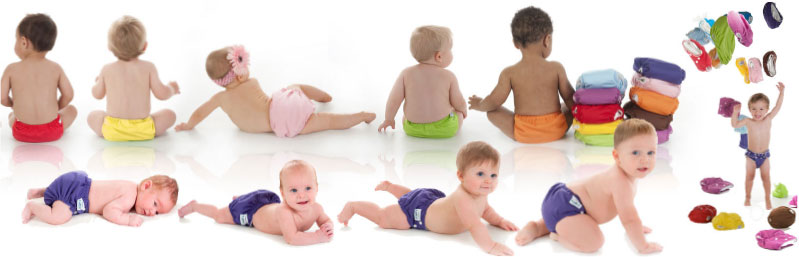
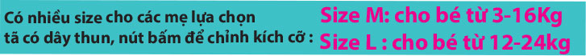

**AnVi Baby** đã có quãng thời gian khá dài để nghiên cứu và khai thác tất cả các tính năng cần thiết của tã em bé.

Chúng tôi cũng là những bậc cha mẹ, chúng tôi thấu hiểu những trăn trở và những mong muốn tốt đẹp nhất bạn muốn dành cho đứa con bé bỏng của mình.

Để tã không còn là gánh nặng kinh tế cho bố mẹ như tã giấy, không còn là nỗi vất vả cho mẹ khi giặt phơi tã như tã vải truyền thống.

**AnVi Baby** đã tích cực trong việc nghiên cứu và tiếp nhận phản hồi, để hôm nay chúng tôi tự hào với sản phẩm tã vải hiện đại **AnVi Baby** thật sự tiện lợi, an toàn cho bé và tiết kiệm tối đa cho mẹ.

**AnVi Baby** không đơn giản chỉ là thương hiệu mang tên của những người sáng lập, nó còn mang một ý nghĩa tốt đẹp chúng tôi hướng đến đó là: An tòan cho những trẻ em Việt Nam.

##### Mọi chi tiết xin liên hệ: #####

- Công ty TNHH Sản xuất & thương mại AN VI
- Địa chỉ : 373/182 Lý Thường Kiệt Tân Bình Tp.HCM
- Xưởng sản xuất : Lô 22 khu công nghiệp Dung Quất Quảng Ngãi
- Điện Thoại : **0973.260.062   0935.258.885**
- Email : **info@anvibaby.com**, website: **www.anvibaby.com**

